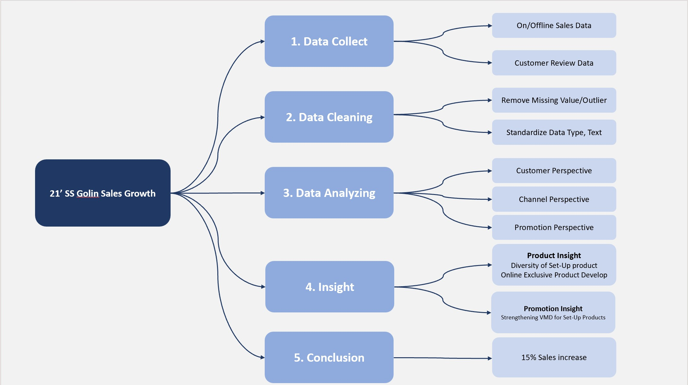

# Sales Analysis for Goldwear

## 🎯The Problem
For the Korean brand 'Golin,' which specializes in youthful golf wear targeting individuals in their 2030s, we have undertaken a product prediction for the upcoming season to expand our market share. Golin, a brand that has been steadily growing since its launch in 2016, is facing a slowdown in growth due to the recent trend of golf becoming popular following the COVID-19 pandemic. Not only sportswear brands but also casual brands have launched golf-wear lines, which has increased competition. We initiated an EDA analysis to improve the brand's growth rate and sales performance in this context.
### |"Objective"
As the domestic golf-wear market in Korea continues to expand, competition within the market has intensified. Our goal is to convert existing customers into more loyal ones and predict products that can enhance the loyalty of new customers.

## 🎯Result
### [Golin Product Predict EDA Pipeline]

##

#### 1.[Data Collect]

• Sales Data

• Customer Review Data

#### 2.[Data Cleaning]

• Removing Missing Values/Outliers

• Standardizing Data Type, Text)

#### 3.[Data Analyzing]

• Customer Perspective

• Channel Perspective

• Promotion Perspective

#### 4.[Insight]

• Product Insight

• Promotion Insight

#### 5.[Conclusion]

##

### 1.[📊 Data Collect]
Golin collected sales data over three years from over 20 offline stores and over 15 online channels. This data was used to forecast the product lineup for the upcoming season. Additionally, customer satisfaction surveys were conducted in offline stores, and over 1,000 product reviews were collected and analyzed online.

##

### 2.[🧹Data Cleaning]
Files with empty 'customer ID' were removed. Files with less than 1% errors were corrected if they were simple typos; otherwise, they were removed. This process involved handling missing values and outliers in the raw data. The data types were standardized for both online and offline data, as well as the text types. Furthermore, sales data from offline agents and online malls were integrated into a single dataset.

##

### 3.[🔍Data Analyzing]
Problem Definition:
The goal is to understand customer behavior patterns using a funnel approach and identify bottleneck stages in the scenario. Additionally, segmentation of users will be conducted to derive useful insights for improving bottlenecks.

#### [📝Customer Perspective]
#### | Hypothesis 1
The stage where most exits occur will likely be the transition from viewing the detailed purchase page to completing the purchase (Bottleneck).

***Reason***: Since making a purchase involves actual payment, it is anticipated that the likelihood of exit is high at this stage.

***Analysis Outcome*:** Over the past three years, significant revenue growth has been mostly driven by new customers. However, there is an issue with new customers consistently entering but not staying and ultimately churning. It was observed that, except for the top 3 grades (top 30% in terms of purchase amount) when classified based on customer grades determined by purchase amount, most customers make only one purchase and then churn. The churn rate is exceptionally high, indicating the need to explore ways to reduce churn.

#### | Hypothesis 2
There will be statistically significant differences in conversion rates or churn rates based on group conditions.

***Reason*:** Group conditions are a significant factor influencing customer behavior patterns. Therefore, it is anticipated that there will be statistically significant differences in conversion and churn rates between groups. Further segmentation within groups may yield more precise results.

***Analysis Outcome*:** There were differences in item purchases based on customer grades determined by purchasing power. For lower-priced items like t-shirts and pants, sales ratios were similar across grades from 0 to 9. However, for higher-priced items like jackets and jumpers, customers in grades 4-9 (those who spend less at Golin) exhibited lower purchasing power. Strategies to sell higher-priced items to customers in lower grades need to be explored.

#### | Hypothesis 3(Shopping Bag Analysis)
There will be differences in purchasing behavior between cases where customers buy 1 item and cases where they buy 2 or more items.

***Reasons***: Some customers are expected to prefer purchasing only 1 item, indicating high interest or necessity for that specific item. Other customers are expected to tend to buy two or more items together, indicating a strategy to meet various needs or take advantage of discounts.

***Analysis Outcome***: For single-item purchases, patterns were predominantly observed in outerwear like down jackets and jackets. 40% of down jackets and jackets were sold as single items. For purchases of 2 or more items, sweaters, casual jackets, and vests exceeded 80% of total sales. Therefore, for these items, the rate of multiple purchases was high. Diversification in Set-Up products and Visual Merchandising (VMD) is needed to encourage multiple purchases.

#### [🏢Channel Perspective]
#### | Hypothesis 4
There will be differences in item purchasing patterns across distribution channels.

***Reason***: Each distribution channel is expected to influence customer shopping experiences, resulting in varying priorities for products sold in each channel.

***Analysis Outcome***: High-spending consumers, especially those in department stores, showed a trend of selling a wide range of products from high-priced jackets and jumpers to lower-priced t-shirts and pants. However, in channels where consumers have relatively lower purchasing power such as online, agents, and discount stores, sales were concentrated on lower-priced t-shirts. Strategies or promotions to entice consumers with lower purchasing power are necessary.

#### | Hypothesis 5
There will be differences in monthly purchasing patterns across distribution channels.

***Reason***: Customer purchasing patterns over time may vary depending on the distribution channel. Therefore, comparing monthly purchasing patterns in each channel is expected to be meaningful.

***Analysis Outcome***: For online and agents, apart from the seasonal off-sale period, there was not a significant difference in the magnitude of changes in sales patterns. However, for department stores, sales were concentrated during the seasonal off-sale period, and in other periods, purchases were notably low.

#### [📢Promotion Perspective]
There will be significant differences in sales performance for different promotions.

***Reason***: Various promotions are expected to impact product sales. It is especially important to determine which promotions are most effective based on agent and department store criteria.

***Analysis Outcome***: For offline agents, sensitivity to discount periods was observed. Therefore, adjustments to product composition, reducing the proportion of new items, and increasing the proportion of carry-over items in the product lineup were recommended. For offline department stores, promoting sales by focusing on new items and planning promotions to increase customer repurchase rates are necessary. Online channels, being highly sensitive to trends and prices, require the development of trendy collaborative products. Additionally, there is a need to specialize in products for online malls.

##

### 4.[🕵️‍♂️Insights]
####  1. Product Perspective
Move beyond the simple set-up of "tops + bottoms" and explore diversifying set-up configurations like "1. Sweater/Jumper + Pants + Accessories," "2. Vest + T-shirt + Pants," "3. Vest + Jumper + T-shirt," and more.

#### 2. Promotion Perspective
Segment the On/Offline promotions target. Develop Offline Exclusive products, focusing on well-selling single-piece items like T-shirts. Also, pursue collaborations with artists or brands that consumers are most interested in, as online exclusive promotion offerings.

##

### 5.[📈Conclusion]
#### |“The Set-Up category saw an impressive 15% surge in sales.”
Following the 21SS product launch, the combination of sweaters/jumpers and accessories, such as golf sun caps, socks, and UV protection arm sleeves, was well-received by customers. This deliberate inclusion of accessories heightened the coherence and sophistication of the outfits and elevated customer satisfaction. Notably, sales of this combination increased by 15% from the 20FW season, which is a significant achievement in an industry where the fall-winter season typically outperforms spring-summer.
